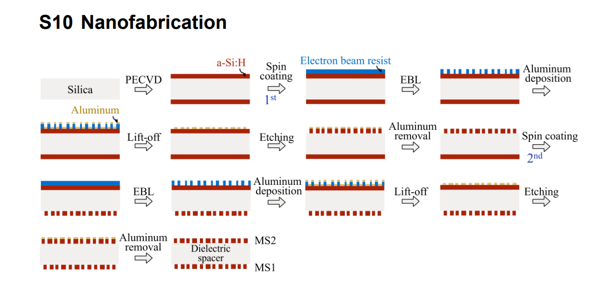
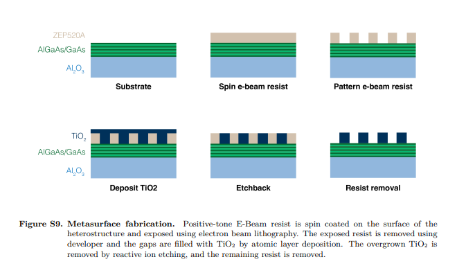

# 四类材料加工工艺路线对比（Si / Si₃N₄ / TiO₂ / PMMA）

> - 日期：2026-09-11
> - 范围：1550 nm；玻璃基超表面；波导 + 超表面（超表面波导）器件
> - 用途：支撑汇报稿**第 10 页**「四种材料不是取舍：推进路线与加工方式差异」
> - 素材：**图 1**、**图 2** 为项目内截图（来源见 §8），Si₃N₄ 与 PMMA 两条路线本次无配图，按仓库文献补齐
> - 配套：[1550 nm 玻璃基超表面材料选型与工艺路线](2026-09-09_1550nm玻璃基超表面材料选型与工艺路线.md)、[a-Si:H 材料与 1550 nm 工艺说明](2026-09-09_a-SiH材料与1550nm工艺说明.md)、[EBL 后硬掩模的作用与工艺顺序](2026-09-09_EBL后硬掩模的作用与工艺顺序.md)

---

## 1. 先明确口径：四种材料不是"四选一"

- **不是取舍关系，而是推进路线。**四类材料不是候选淘汰赛，而是"能力递进 + 风险递进"的分步推进：先把**最简单的一步**做出来（熔融石英上直接沉积 Si），再按器件需求向低损耗、透射型、单晶硅平台逐级扩展。
- **第一步 = 熔融石英（HPFS 7980）+ Si（PECVD a-Si:H）。**理由是最短工艺链：玻璃衬底直接沉积、**不需要键合或层转移**、衬底透明（可背面测辐射方向图）、D100 级见证片成本最低（询价 ≈¥1250/片，[E13]）。
- **第一步器件目标 = 超表面波导，先做光栅耦合器。**先解决"导模 ↔ 自由空间"的激励端，再叠加超表面对空间光辐射（方向、相位/波前、振幅、偏振）进行调控。
- **选材过程中的一个重要发现：SOI（SOITEC 等）在文献与产业中用得最多。**例如 Q1-12（Taillaert 2006）用的就是 **200 mm SOI（SOITEC，220 nm Si / 1 µm BOX）**；项目的 L02、A1 也在 SOI 上。因此 SOI 登记为**文献见证平台 + 后续迁移目标**，而不是第一轮起点（理由见 §7、第 8 页）。
- **因此本页要回答的不是"谁更好"，而是"每种材料的器件是怎么做出来的、我们第一步能继承哪一段"。**

推进路线（能力与风险逐级上升）：

```text
第 0 步（本项目起点，工艺最短）
  熔融石英 HPFS 7980 + PECVD a-Si:H  ← 光栅耦合器 + 波导超表面
        │  需要更长传播距离 / 更低波导损耗
第 1 步  Si₃N₄ 平台（PECVD/LPCVD；免刻蚀 or 刻蚀两条子路线）
        │  需要透射型高折射率器件
第 2 步  TiO₂（ALD 反填充 或 厚膜直接刻蚀）
        │  需要单晶硅 / 更成熟的代工与供应链
第 3 步  SOI（SOITEC 220 nm 标准）/ SiOG（超薄硅膜、界面预制备）
   并行  PMMA —— 最快工艺闭环与最终低折射率结构（自由膜）
```

---

## 2. 三条加工哲学（先看框架，再看配方）

| 加工哲学 | 代表材料/器件 | 图形从哪里来 | 材料什么时候进入 | 优点 | 代价 |
| --- | --- | --- | --- | --- | --- |
| **减法（top-down etch）** | Si（a-Si:H）、Si₃N₄ | 胶图案 → （金属/氧化物）硬掩模 → 刻蚀转移 | 先沉积整层膜，再刻掉不要的部分 | 膜质量可控、柱高自由、可做高深宽比 | 需要刻蚀选择比/侧壁控制，硬掩模残留与侧壁粗糙直接吃效率 |
| **加法（gap-fill / ALD）** | TiO₂（T6、F-11） | 胶孔阵列（反图形） | 刻蚀之后才填入材料 | 高折射率材料无需深刻蚀；ALD 保形、填窄缝好 | ALD 时间长；易有缝/空洞；必须回刻（etchback）过生长层 |
| **免刻蚀（patterning-only）** | PMMA（L01/L04）；Si₃N₄ 的 PMMA 子路线 | 胶图案**本身就是器件** | 图案=材料，无需再转移 | 步骤最少（3 步）、无危险化学品、迭代最快 | 折射率对比低（n≈1.5），需衬底/悬空设计撑住模式 |

> 光学上的差别（n、k、约束）见汇报稿第 3–7 页；本页只回答"加工能力"。

---

## 3. Si：PECVD a-Si:H + Al 硬掩模 + 氟基 ICP-RIE



**图 1｜Si（a-Si:H）加工流程**：Silica 衬底 → PECVD a-Si:H → 旋涂正胶 → EBL → 镀铝 → lift-off → 刻蚀 → 去铝；翻面后重复同一流程得到 **MS2**，与 **MS1** 之间是 **dielectric spacer**。

来源：D5 Li *et al.*, *Nanophotonics* **11**(2), 405–413 (2022)，支持信息 **Figure S10 "Nanofabrication"**；[PDF](<../../../literature/材料体系分类/Si/1550波段/pdfs/D5_Li_2022_Flat_Telescope_Metasurface_Doublet.pdf>)、[阅读笔记](../../../literature/材料体系分类/Si/1550波段/阅读笔记_D5_Li_2022.md)。[E14]

### 3.1 完整流程与参数（原文）

| 步骤 | 参数（原文） |
| --- | --- |
| 衬底 | **902 µm 熔融石英**，丙酮/IPA/去离子水清洗（同时作 **dielectric spacer**，n=1.44） |
| 功能层 | **两面各 PECVD 880 nm a-Si:H**（Plasmalab 100, Oxford） |
| 胶 | **ZEP520A 正胶**（Zeon）旋涂单面；**Espacer 300Z**（Showa Denko）抗充电 |
| 图形化 | **EBL（Raith150）** → **ZED-N50** 显影，写出 MS1 与**对准标记** |
| 硬掩模 | **60 nm Al 电子束蒸发**（Temescal BJD-2000）→ **ZDMAC lift-off** 去除多余铝，留下**图案化铝作硬掩模** |
| 转移 | **氟基 ICP-RIE**（Oxford Plasmalab System 100）把图形刻入 a-Si:H |
| 去掩模 | **湿法刻蚀**去除纳米柱上的残余铝 |
| 第二面 | 翻面，用**透射光学显微镜**按对准标记套刻，**重复同一整套流程**做 MS2（两面对准偏差可通过初始装夹角补偿） |

- 结构结果：纳米柱高 **880 nm**；单个超表面（MD）占据直径 **500 µm** 区域。

### 3.2 本项目第一步该继承什么、可以省什么

| 结论 | 说明 |
| --- | --- |
| **该继承：Al 硬掩模 + 氟基 ICP-RIE** | 胶直接做掩模刻 880 nm 高柱，选择比通常不够；金属硬掩模是"高柱 + 陡直侧壁"的成熟做法 |
| **该继承：Espacer 抗充电** | 绝缘玻璃衬底上 EBL 必须处理充电（与 L01、L04 的结论一致） |
| **可省略：双面套刻** | 第一轮只做单面（光栅耦合器 + 超表面在同一面），不需要翻面 MS1/MS2 对准 |
| **需替换：胶型号** | ZEP520A 与 PMMA 950K 均可；L01 用 PMMA 950K（100 keV、750 µC/cm²），F-02 用 ZEP520 |
| **需自测：刻蚀配方** | 原文未给具体气体/功率；本机须做刻蚀 DOE（速率、选择比、侧壁角、残留）——对应汇报稿第 9 页"刻蚀 DOE"关口 |

### 3.3 同源 Si 工艺（仓库内可互相印证）

| 文献 | 工艺流程 | 与图 1 的关系 |
| --- | --- | --- |
| Q1-11 Kuehne 2021 | 100 nm a-Si（PECVD）/熔融石英；PMMA 950K A2 + Espacer 300Z；EBL；3:1 MIBK:IPA 显影 | **胶材与抗充电参数更完整**（薄 a-Si 层的低损耗超表面） |
| C2 Arbabi 2015（[E2]） | a-Si + **Cr/Al₂O₃ 硬掩模 lift-off** + RIE；熔融石英 + 1550 nm 直接器件证据 | 硬掩模链的另一种选材（Cr/Al₂O₃ 替代 Al） |
| F-12 Yang 2020 / F-17 Zhao 2021 | PMMA 写反图 → **Cr 硬掩模 lift-off** → RIE → 去 Cr；F-17 另有 100 nm Al 挡光层套刻 | 同一"胶 → 硬掩模 → RIE → 去掩模"模块，参数可直接对标 |

> 一致性结论：**"胶 → 金属硬掩模 → 氟基干法刻蚀 → 湿法去掩模"是 Si 体系在玻璃上的共同模块**，差异只在掩模材料（Al / Cr / Al₂O₃）、胶型号和刻蚀气体。

---

## 4. TiO₂：反图形 EBL + ALD 保形填充 + 回刻



**图 2｜TiO₂ 加工流程（与 Si 相反）**：Al₂O₃(sapphire) + 键合转移的 AlGaAs/GaAs 外延层 → 旋涂 ZEP520A → EBL 图形化（**反图形**） → **ALD 沉积 TiO₂ 填孔** → **回刻（etchback）** → 去胶。

来源：T6 Fathi *et al.*, *Nature Nanotechnology*（2026 在线），支持信息 **Figure S9 "Metasurface fabrication"**；[PDF](<../../../literature/材料体系分类/TiO2/1550波段/pdfs/T6_Fathi_2026_Quantum_Well_TiO2_Metasurface.pdf>)、[阅读笔记](../../../literature/材料体系分类/TiO2/1550波段/阅读笔记_T6_Fathi_2026.md)。[E15]

### 4.1 完整流程与参数（原文 + 笔记）

| 步骤 | 参数 |
| --- | --- |
| 衬底/功能层 | **Al₂O₃（sapphire）** + 键合转移的 **16 周期 GaAs/AlGaAs MQW**（总厚 ≈595 nm，泵浦相关功能层） |
| 胶 | **ZEP 520A 正胶**：3800 rpm 45 s；90 °C 3 min + 180 °C 3 min；**ESPACER 300** 抗充电 |
| 图形化 | **EBL 150 kV、1 nA**；**o-xylene** 显影 → 得到**胶孔阵列（反图形）** |
| 填充 | **ALD 沉积 TiO₂** 保形填入胶孔 |
| 回刻 | **RIE 回刻**过生长的 TiO₂ 层（etchback），露出胶顶 |
| 去胶 | **Remover PG** 去除残余胶，得到 TiO₂ 纳米柱 |
| 结构结果 | 柱高 **390 nm**、半径 230 nm、x/y 周期 891/650 nm；GMR 实测共振 1.567 µm |

### 4.2 与 Si 路线的三点关键差异

| 维度 | Si（图 1，减法） | TiO₂（图 2，加法） |
| --- | --- | --- |
| 图形极性 | **正图形**：胶留下 → 硬掩模 → 刻材料 | **反图形**：胶孔留下 → 填充材料 → 去胶 |
| 关键设备 | ICP-RIE（高深宽比刻蚀） | **ALD**（保形填充）+ RIE（仅做回刻，浅） |
| 主要失效模式 | 侧壁粗糙、深宽比不足、硬掩模残留 | 填充空洞/缝隙、回刻过冲或欠刻、ALD 厚度均匀性 |
| 高度自由度 | 高（880 nm 级柱可做） | 中（本例 390 nm；传播相位柱需 1.3–1.8 µm，ALD 更慢） |

### 4.3 与本项目 TiO₂ 备选路线的关系

- **玻璃上的反填充先例**：F-11 Devlin 2016 在**熔融石英**上用反图形 + **ALD TiO₂** 做器件（[E8]）——与本页图 2 同族工艺，但波段是可见光。
- **另一条路是"厚膜 + 直接刻蚀"**：F-26 Wang 2021（TiO₂ 厚膜蒸发/沉积 + 硬掩模 + RIE，[E11]），不依赖 ALD 填充，但对厚膜应力和深刻蚀要求更高。
- **本项目判断**：TiO₂ 的价值在透射型高折射率器件与低吸收潜力，但**尚无"TiO₂ + HPFS 7980 + 1550 nm 高效率"直接实验**（[E6][E7][E10]），且 ALD 工序在项目当前工艺链之外 → 列为第 2 步/备选，不进入第一轮。

---

## 5. Si₃N₄：同一材料的三条加工子路线（仓库文献补齐）

> 本次没有对应配图；以下按仓库文献补齐，均给出参数级依据。

| 子路线 | 依据 | 流程与参数 | 适用与代价 |
| --- | --- | --- | --- |
| **① 免刻蚀（PMMA-only）** | L01 Huang 2023，*Nat. Nanotechnol.* 18, 580–588（[E5]） | PECVD **300 nm Si₃N₄**（180 µm 熔融石英）→ 旋涂 **300 nm PMMA**（180 °C 烘，兼作 EBL 胶）→ EBL（**100 keV、1 nA、750 µC/cm²**，BEAMER PEC）→ **3:1 IPA:去离子水**显影；**不刻 Si₃N₄** | 步骤最少、与 PMMA 兼容；但 Si₃N₄ 只是**连续承载膜**，不是被刻的柱 |
| **② 刻蚀型（ZEP520 + RIE）** | F-02 Tian 2025，*Light Sci. Appl.* 14, 94 | **PECVD 160 nm Si₃N₄**（Oxford Plasma Pro 100，300 °C）→ ZEP520 正胶 → EBL（JEOL 9500，**100 kV**）→ **RIE CHF₃/SF₆/N₂** 刻穿 160 nm → **O₂ descum** | 真正的"刻蚀型 Si₃N₄ 超表面"；须管**应力**（300 °C PECVD 于薄玻璃）与选择比 |
| **③ 量产型（LPCVD + DUV）** | F-01 Yesilkoy 2026，*Nano Lett.* 26(6), 2059–2067 | **LPCVD 160 nm Si₃N₄** 于 4 in 熔融石英 → **60 nm BARC + 230 nm DUV 化学放大胶** → **248 nm KrF 步进曝光**（全片 1–2 min，EBL 需数小时）→ **O₂ ICP 开 BARC** → **CF₄/O₂ 刻 Si₃N₄**；用**曝光剂量控制孔深** | 面积/量产路线（"DUVL 只做研发后段"）；代价是掩模版与工艺开发门槛 |

**关键判断**：Si₃N₄ 的材料优势（通信波段低传播损耗）**只有在"刻蚀型"子路线上才变成器件级优势**；若走 ①（免刻蚀），得到的其实是"PMMA 图案 / Si₃N₄ 连续膜 / 玻璃"复合平台（对应汇报稿第 7 页）。材料与损耗背景见 L03 Buzaverov 2024（[E4]）：PECVD 含氢高→吸收偏大，LPCVD 膜质量更好但高温+应力开裂风险。[E16]

---

## 6. PMMA：旋涂 + EBL + 显影三步成型（仓库文献补齐）

> 本次没有对应配图；以下按仓库文献补齐。

| 路线 | 依据 | 流程与参数 | 适用与代价 |
| --- | --- | --- | --- |
| **A. PMMA 作为 Si₃N₄ 上层扰动/波导边界** | L01 Huang 2023（[E5]） | PECVD 300 nm Si₃N₄ → 300 nm PMMA（180 °C）→ EBL（100 keV、1 nA、750 µC/cm²）→ 3:1 IPA:水显影；**PMMA 保留为最终结构** | 与 ① 同一条流程；PMMA 只做扰动，导模由 Si₃N₄ 承载 |
| **B. 全聚合物自由膜（三步成型）** | L04 Hirler 2026，*ACS Nano* 20(8), 6722–6731（[E9]） | 熔融石英 → SurPass 4000 附着力促进 → **CSAR 62 牺牲层**（两层 ≈1250 nm）→ **AR-P 679.04（PMMA 950K, 4%）3600 rpm → 300 nm**，150 °C 3 min → Espacer 300Z → EBL（Raith eLINE Plus，**20 kV、200–250 µC/cm²**）→ **7:3 IPA:水 20 s + 冷乙酸戊酯 6 °C 10 s + Novec 7100 停显** → 牺牲层溶解**释放自由膜** | 核心只 3 步（旋涂/曝光/显影），无沉积无刻蚀；Q 最高 **523**；但折射率低，必须**悬空或加高折射率承载层**；**尖角易撕裂**（版图要倒圆角） |

**关键判断**：PMMA 路线测的是"曝光与显影能力"（剂量、邻近效应、抗充电、线宽），是**最快建立工艺闭环**的路径；它不能作为裸 HPFS 上的 1550 nm 主光学层（n≈1.48 vs 玻璃 1.44，对比度约 0.04）。

---

## 7. 与本项目第一轮的关系（映射到第 9 页实验关口）

| 第一轮决定 | 选择 | 依据 |
| --- | --- | --- |
| 平台 | **熔融石英 HPFS 7980 + PECVD a-Si:H**（不算 SOI） | 无键合/层转移、衬底透明、D100 见证片成本最低 [E13]；与 C2（a-Si:H + 熔融石英 + 1550 nm）最接近 [E2] |
| 器件顺序 | **先光栅耦合器（激励端）**，后波导超表面（辐射端） | 先把"导模 ↔ 自由空间"的输入打通；两类器件对衬底的要求不同，见第 8 页"器件类型 × 衬底" |
| 图形化 | EBL（PMMA 950K 或 ZEP520A）+ **Espacer 抗充电** | L01 / L04 / D5 / F-02 一致 |
| 刻蚀 | **Al 硬掩模 + 氟基 ICP-RIE**（图 1 模块） | 880 nm 级柱需金属硬掩模；本机需做刻蚀 DOE |
| 第一轮不做 | 双面套刻（MS1/MS2）、ALD 反填充、DUV 量产、自由膜释放 | 各自对应第 1–3 步或量产阶段 |
| 记录在案的迁移目标 | **SOI（SOITEC，200 mm、220 nm Si/1 µm BOX、DUV 248 nm + 两步刻蚀）** | Q1-12 Taillaert 2006 的产业级参考；L02/A1 的见证平台 |

> 一句话：**第一轮把"玻璃上沉积 Si → EBL → 硬掩模 → 干法刻蚀 → 光栅耦合器出光"这条链跑通，就已经覆盖了 Si₃N₄（刻蚀型）、C2/Arbabi 类器件、后续 SOI 迁移的绝大部分工艺模块。**

---

## 8. 素材来源与版权边界（发布前必读）

| 图 | 出处 | 版权与使用边界 |
| --- | --- | --- |
| 图 1 | Li *et al.*, *Nanophotonics* **11**(2), 405–413 (2022)，Supporting Information **Figure S10** | *Nanophotonics*（De Gruyter）为**开放获取**期刊；转载时保留出处与 DOI 标注 |
| 图 2 | Fathi *et al.*, *Nature Nanotechnology*（2026），Supporting Information **Figure S9** | © Springer Nature，**非开放获取**；当前仓库为 **Private**，公开前必须**移除或替换**该图（与仓库内 ACS/出版社 PDF 同一处理口径，见 `literature/材料体系分类/Si/1550波段/README.md`） |

其他边界：

- 表中所有参数均为**各文献自报值**，不是本项目实测；工艺迁移必须经本机见证片验证（n、k、膜厚、应力、粗糙度、刻蚀 CD）。
- 图 1、图 2 均为**项目内截图**，非重新绘制；若对外汇报需要可商用素材，应改为自绘示意图。
- SOI/SOITEC 的产业成熟度属供应链事实（V/P 级），不能据此宣称本项目第一轮就应改用 SOI；理由见第 8 页"器件类型 × 衬底"。

---

## 9. 来源

- **[E14]** D5 Li 2022：Li *et al.*, *Nanophotonics* **11**(2), 405–413 (2022)，DOI [10.1515/nanoph-2021-0609](https://doi.org/10.1515/nanoph-2021-0609)——双面 a-Si:H 超表面 + Al 硬掩模 + 氟基 ICP-RIE（图 1、§3）。
- **[E15]** T6 Fathi 2026：Fathi *et al.*, *Nature Nanotechnology* (2026)，DOI [10.1038/s41565-026-02268-0](https://doi.org/10.1038/s41565-026-02268-0)——反图形 EBL + ALD TiO₂ 填充 + 回刻（图 2、§4）。
- **[E16]** Si₃N₄ 三条子路线：L01 Huang 2023（*Nat. Nanotechnol.* 18, 580–588，DOI [10.1038/s41565-023-01360-z](https://doi.org/10.1038/s41565-023-01360-z)）、F-02 Tian 2025（*Light Sci. Appl.* 14, 94，DOI [10.1038/s41377-025-01761-w](https://doi.org/10.1038/s41377-025-01761-w)）、F-01 Yesilkoy 2026（*Nano Lett.* 26(6), 2059–2067，DOI [10.1021/acs.nanolett.5c05226](https://doi.org/10.1021/acs.nanolett.5c05226)）；材料与损耗背景 L03 Buzaverov 2024（DOI [10.1002/lpor.202400508](https://doi.org/10.1002/lpor.202400508)）（§5）。
- **[E17]** PMMA 工艺：L04 Hirler 2026（*ACS Nano* 20(8), 6722–6731，DOI [10.1021/acsnano.5c15415](https://doi.org/10.1021/acsnano.5c15415)）、Q1-11 Kühne 2021（*Nanophotonics* 10(17), 4305–4312，DOI [10.1515/nanoph-2021-0391](https://doi.org/10.1515/nanoph-2021-0391)）（§6）。
- **[E18]** SOI/SOITEC 产业参考：Q1-12 Taillaert 2006（*Jpn. J. Appl. Phys.* 45(8A), 6071–6077，DOI [10.1143/JJAP.45.6071](https://doi.org/10.1143/JJAP.45.6071)；200 mm SOI/SOITEC、220 nm Si/1 µm BOX、DUV 248 nm、两步刻蚀）（§1、§7）。
